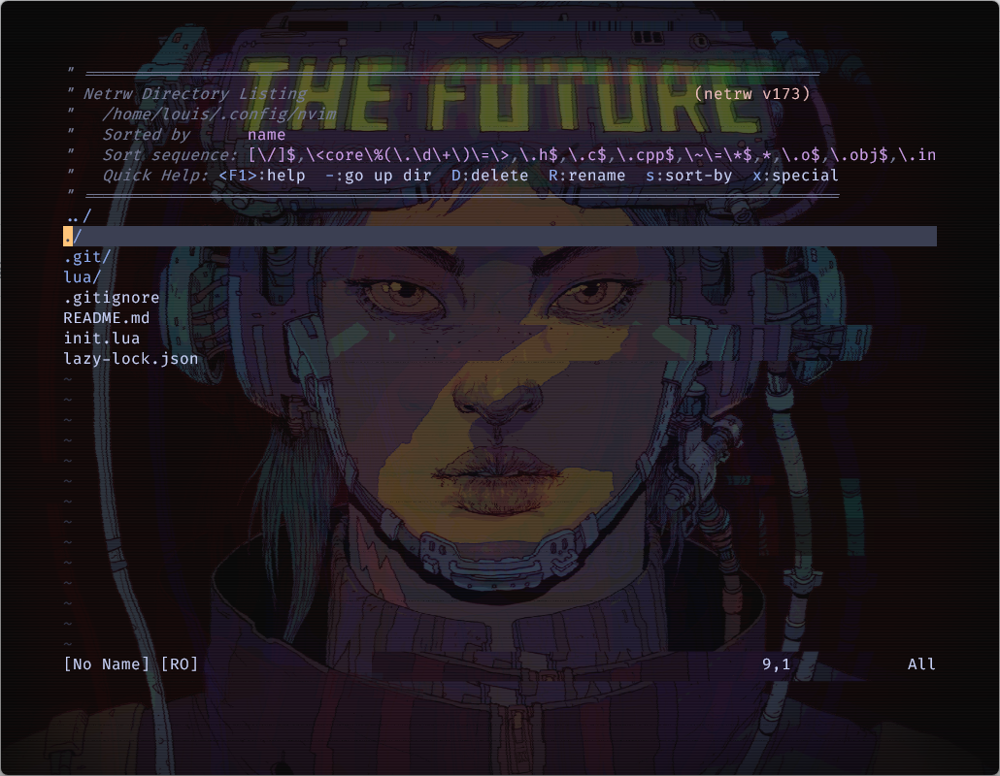

# lc-lazy-nvim

## About
My personal spin on ThePrimeagen's [neovim config](https://github.com/ThePrimeagen/init.lua).
Uses [lazy.nvim](https://github.com/folke/lazy.nvim) as package manager.
I might write some tutorials at some point.

## Credits
Includes a modified cover of William Gibsons' _Mona Lisa Overdrive_ by [Josan "Deathburger" Gonzalez](https://github.com/folke/lazy.nvim), to be used as a background image in the terminal for maximum hacker cred. 
More cyberpunk goodness courtesy of Gonzalez on his personal website [Citadel9](https://citadel9.com/).
